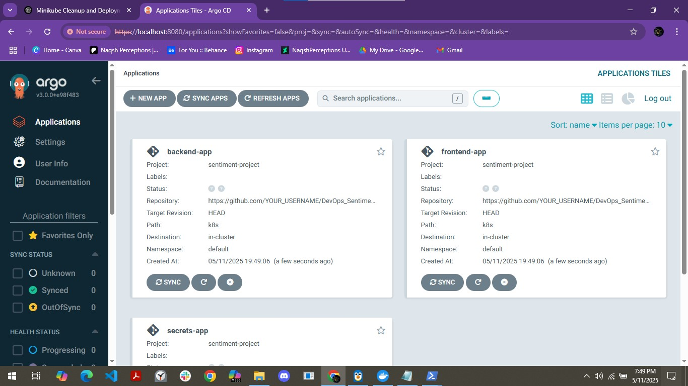
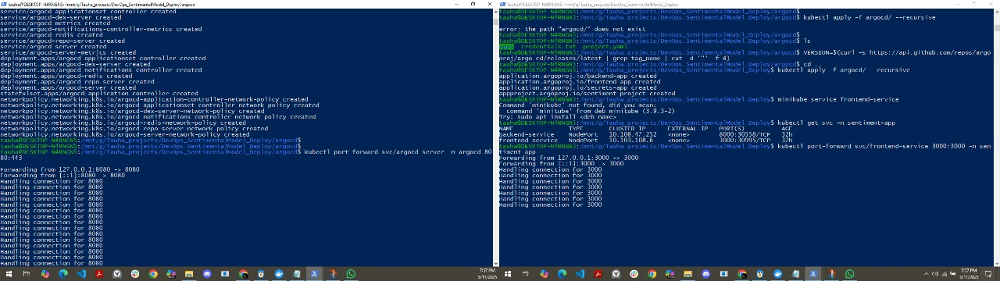

# 🚀 ArgoCD GitOps Deployment (Sentiment Analysis App)

This folder contains the GitOps configuration for deploying the **Sentiment Analysis App** using **ArgoCD**, with a local Kubernetes setup on **WSL + Docker Desktop + Minikube**.

---

## 🧰 Tools Used

| Tool             | Role                                                                 |
|------------------|----------------------------------------------------------------------|
| **WSL**          | Your Linux CLI environment for running all setup commands            |
| **Docker Desktop** | Provides the container engine and networking for Minikube            |
| **Minikube**     | Runs a local Kubernetes cluster using Docker as the driver           |
| **kubectl**      | CLI for managing Kubernetes resources                                |
| **ArgoCD**       | Automates deployment from Git to Kubernetes via GitOps               |

---

## 📁 Folder Structure

```

argocd/
├── project.yaml              # Defines ArgoCD project 'sentiment-project'
├── credentials.txt           # details of log in info + cli commands
├── READMD.md #This file you are reading
└── apps/
|  ├── secrets-app.yaml      # Deploys Kubernetes secrets
|  ├── backend-app.yaml      # Deploys the FastAPI backend
|  └── frontend-app.yaml     # Deploys the React frontend
└── docs/
  ├── argocd_ui.jpg
  └── argocd_cli.jpg

````

---

## 🔧 What This Does

- **project.yaml**: Defines an ArgoCD "project" that groups your apps and sets allowed Git repos and destinations.
- **apps/*.yaml**: Each file registers a Kubernetes manifest directory (`k8s/`) as an ArgoCD application.
- **Automated Sync**: Changes pushed to Git are auto-deployed into the Kubernetes cluster.

---

## ⚙️ How to Set It Up (Locally)

### 1. Install ArgoCD

```sh
kubectl create namespace argocd

kubectl apply -n argocd \
  -f https://raw.githubusercontent.com/argoproj/argo-cd/stable/manifests/install.yaml
````

---

### 2. Access the ArgoCD UI

```sh
kubectl port-forward svc/argocd-server -n argocd 8080:443
```

Then open: [https://localhost:8080](https://localhost:8080)

* **Username**: `admin`
* **Password**:

  ```sh
  kubectl get secret argocd-initial-admin-secret -n argocd \
    -o jsonpath="{.data.password}" | base64 --decode && echo
  ```

---

## 🖼️ ArgoCD Interface

### Web UI (Dashboard)

> The ArgoCD web dashboard showing deployed apps



---

### CLI View

> ArgoCD CLI displaying synced applications and statuses



---

## 🛰️ Deploy Your Apps via Git

Once your code is in GitHub or any Git repo:

```sh
kubectl apply -f argocd/ --recursive
```

This will:

* Create the ArgoCD project
* Register apps for backend, frontend, and secrets
* Start syncing from Git into Kubernetes

---

## ✅ Access the Deployed App

```sh
minikube service frontend-service
```

> This will open the frontend in your browser, connected to your FastAPI backend.

---

## 🎯 Result

You we have a complete local GitOps pipeline with:

* 🐳 Docker-based builds
* ☸️ Kubernetes deployment via manifests
* 🤖 GitOps sync using ArgoCD


