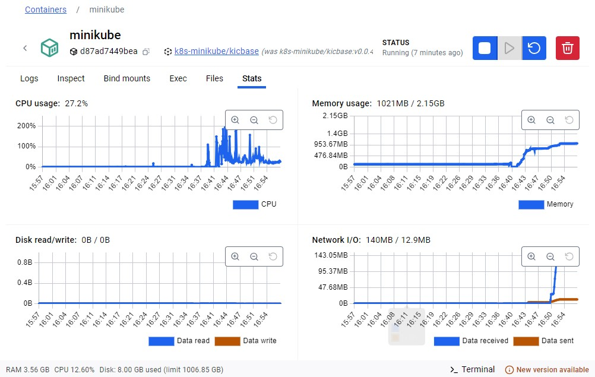

## Kuberenetes implementation part

### ✅ Step 1: Clean Up Existing Minikube State

Open **PowerShell** or **WSL** and run:

```sh
minikube delete
minikube start --driver=docker
```

This ensures Minikube uses Docker Desktop and resets your cluster.

---

### ✅ Step 2: Use Minikube’s Docker Daemon

To avoid `ImagePullBackOff`, you need to build your images **inside Minikube’s Docker**:

Run:

```sh
minikube docker-env
```

Then, apply the Docker environment variables:

```sh
& minikube -p minikube docker-env | Invoke-Expression  # PowerShell
```

Now build your images manually:

```sh
docker build -t i221239/sentiment-backend ./backend
docker build -t i221239/sentiment-frontend ./frontend
```

These are the same names your Kubernetes YAML expects (`i221239/sentiment-*`), so **no imagePull will be required**.

---

### ✅ Step 3: Apply Kubernetes Configurations

Run in this order:

```sh
kubectl apply -f k8s-secrets.yaml
kubectl apply -f k8s-backend.yaml
kubectl apply -f k8s-frontend.yaml
```

Check pods:

```sh
kubectl get pods
```

If they’re not `Running`, describe them:

```sh
kubectl describe pod <pod-name>
```

---

### ✅ Step 4: Access the App

Expose the frontend NodePort:

```sh
minikube service frontend-service
```

This will open the app in your browser.

---

### Optional: Reset Everything (if needed)

If things break again:

```sh
kubectl delete -f k8s-frontend.yaml
kubectl delete -f k8s-backend.yaml
kubectl delete -f k8s-secrets.yaml
docker rmi i221239/sentiment-backend i221239/sentiment-frontend
```

---

Once this works, you're ready to move to ArgoCD.

Would you like help writing manifests for ArgoCD next?


---

# 🧠 Kubernetes Deployment Guide (Minikube + Docker Desktop)

This guide illustrates how to get a local Kubernetes deployment running on **Minikube** using locally built Docker images.

---

## 🚀 1. Cluster Setup & Image Building

### 1.1 Start Minikube with Docker Driver


Ensure you're using Docker Desktop as the Minikube driver.

---

### 1.2 Build Docker Images *Inside* Minikube


Use `minikube docker-env` to point Docker CLI to Minikube’s Docker daemon, then build your backend and frontend images.

---

### 1.3 Apply Kubernetes Manifests


Use `kubectl apply -f` to deploy your backend, frontend, and secrets.

---

## 🛠️ 2. Verify Docker Images & Cluster

### 2.1 Images in Docker Desktop


You may see the same images in Docker Desktop after building them — but only those built inside Minikube are usable in the cluster.

---

### 2.2 Minikube Dashboard Stats


Launch `minikube dashboard` to see resources, pods, and deployments.

---

## 🧩 3. Running App

### 3.1 Pods in Minikube


Pods should be in `Running` state.

---

### 3.2 Frontend + Backend Running


Once deployed, services like frontend and backend are exposed through `minikube service`.

---

### Bonus Minkube Dashboard GUI


Ensure your secrets were correctly created and mounted into pods.

---

## ✅ Final Result


Your full-stack app is now live in Minikube! 🎉

---

> You’re now ready to move on to GitOps with ArgoCD.
